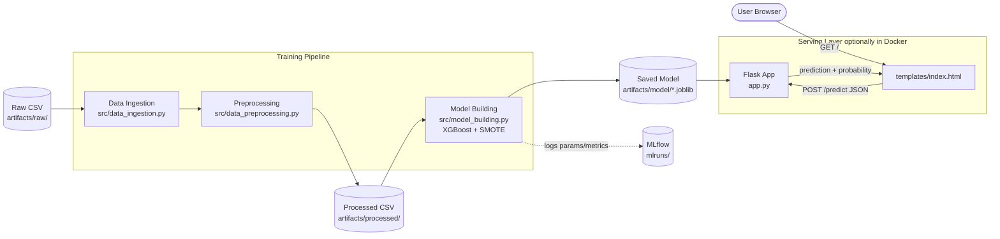

# Hotel Reservation Cancellation Predictor

End-to-end Machine Learning project that predicts whether a hotel booking will be **cancelled** or **confirmed**, served via a Flask web UI and packaged for Docker.

- **Model:** XGBoost classifier (trained with SMOTE oversampling and optional `RandomizedSearchCV` tuning)
- **Tracking:** MLflow (params, metrics, signature, registered model)
- **Serving:** Flask app on port `5001` with a browser UI and a `/predict` JSON API

---

## 🏗️ Architecture



**Flow in plain English:**
1. **Train once:** `pipeline/training_pipeline.py` runs ingestion → preprocessing → XGBoost training, saving a `.joblib` model and logging the run to MLflow.
2. **Serve:** `app.py` loads the saved model at startup and exposes `/`, `/predict`, `/health`.
3. **Predict:** the browser form POSTs JSON to `/predict`; the model returns `Confirmed` or `Cancelled` with a probability.

> 🖼️ An editable draw.io version of this diagram is available at [docs/architecture.drawio](docs/architecture.drawio) — open it on [app.diagrams.net](https://app.diagrams.net) or with the **Draw.io Integration** VS Code extension.

---

## 📁 Project structure

```
app.py                    # Flask web app (UI + /predict + /health)
Dockerfile                # Container build definition
requirements.txt
config/                   # Config & paths
src/
  data_ingestion.py
  data_preprocessing.py
  model_building.py       # Trains XGBoost + logs to MLflow
pipeline/
  training_pipeline.py    # Runs the full training pipeline
templates/index.html      # Prediction form (UI)
artifacts/
  raw/, processed/, model/
mlruns/                   # MLflow tracking store
```

---

## ✅ Prerequisites

- **Python 3.9+** (the Docker image uses 3.9-slim)
- `pip` and `venv`
- Optional: **Docker** *or* **Podman** (the helper script auto-detects both)

---

## 🖥️ Local setup

### 1. Clone & enter the project

```bash
git clone <your-repo-url> Hotel_Reservation
cd Hotel_Reservation
```

### 2. Create a virtual environment

```bash
python3 -m venv .venv
source .venv/bin/activate          # macOS / Linux
# .venv\Scripts\activate           # Windows
```

### 3. Install dependencies

```bash
pip install --upgrade pip
pip install -r requirements.txt
```

### 4. Train the model (one-time)

Runs ingestion → preprocessing → training, and writes the model to `artifacts/model/hotel_reservation_model.joblib`. MLflow runs are logged under `mlruns/`.

```bash
# Full pipeline (recommended for a fresh checkout)
python3 -m pipeline.training_pipeline

# Or just the training step (requires preprocessed data to already exist)
python3 -m src.model_building
```

### 5. (Optional) Inspect MLflow runs

```bash
mlflow ui --port 5000
# Open http://localhost:5000
```

---

## 🚀 Run the web app locally

```bash
python3 app.py
```

You should see:

```
✅ Model loaded successfully from artifacts/model/hotel_reservation_model.joblib
 * Running on http://0.0.0.0:5001
```

Open **http://localhost:5001** in your browser, fill in the form, and click **Predict Cancellation Risk**.

### Endpoints

| Method | Path       | Purpose                                    |
|--------|------------|--------------------------------------------|
| GET    | `/`        | Prediction form (UI)                       |
| POST   | `/predict` | JSON prediction API                        |
| GET    | `/health`  | Health check (`{"status":"healthy",...}`)  |

### Quick API test

```bash
curl http://localhost:5001/health

curl -X POST http://localhost:5001/predict \
  -H "Content-Type: application/json" \
  -d '{"no_of_adults":2,"no_of_children":0,"no_of_weekend_nights":1,"no_of_week_nights":2,
       "type_of_meal_plan":"Meal Plan 1","room_type_reserved":"Room_Type 1",
       "required_car_parking_space":1,"lead_time":5,"arrival_year":2018,
       "arrival_month":12,"arrival_date":15,"market_segment_type":"Online",
       "repeated_guest":1,"no_of_previous_cancellations":0,
       "no_of_previous_bookings_not_canceled":5,"avg_price_per_room":85,
       "no_of_special_requests":2}'
```

Stop the server with `Ctrl + C`.

---

## 🐳 Run with Docker (or Podman)

> ⚠️ The container expects a trained model at `artifacts/model/hotel_reservation_model.joblib`. Train it locally first (Step 4 above) — `artifacts/` is mounted **read-only** into the container.

### 1. Build the image

```bash
docker build -t hotel-reservation:latest .
# Podman users: replace `docker` with `podman`
```

### 2. Run the container

```bash
docker run -d \
  --name hotel-reservation-app \
  -p 5001:5001 \
  -v "$(pwd)/artifacts:/app/artifacts:ro" \
  hotel-reservation:latest
```

### 3. Verify it's running

```bash
docker ps
curl http://localhost:5001/health
```

Open **http://localhost:5001** in your browser to use the UI.

### 4. Tail logs / stop / clean up

```bash
docker logs -f hotel-reservation-app          # follow logs
docker stop hotel-reservation-app             # stop
docker rm hotel-reservation-app               # remove container
docker rmi hotel-reservation:latest           # remove image
```

### Use a different host port

```bash
docker run -d -p 8080:5001 \
  -v "$(pwd)/artifacts:/app/artifacts:ro" \
  --name hotel-reservation-app hotel-reservation:latest
# Now: http://localhost:8080
```

---

## 🧪 Sample inputs to test both outcomes

| Field                           | ✅ Confirmed | ❌ Cancelled  |
|---------------------------------|-------------|--------------|
| No. of Adults                   | 2           | 2            |
| No. of Children                 | 0           | 0            |
| Weekend Nights                  | 1           | 2            |
| Week Nights                     | 2           | 5            |
| Meal Plan                       | Meal Plan 1 | Not Selected |
| Room Type                       | Room_Type 1 | Room_Type 1  |
| Car Parking Required            | Yes         | No           |
| Lead Time                       | 5           | 350          |
| Arrival Year                    | 2018        | 2018         |
| Arrival Month                   | December    | October      |
| Arrival Date                    | 15          | 2            |
| Market Segment                  | Online      | Online       |
| Repeated Guest                  | Yes         | No           |
| Previous Cancellations          | 0           | 0            |
| Previous Bookings Not Cancelled | 5           | 0            |
| Avg Price per Room              | 85          | 180          |
| Special Requests                | 2           | 0            |

---

## 🛠️ Troubleshooting

| Issue                                          | Fix                                                                              |
|------------------------------------------------|----------------------------------------------------------------------------------|
| `Model not found at artifacts/model/...`       | Run `python3 -m pipeline.training_pipeline` to generate the joblib file.         |
| Port 5001 already in use                       | Change the port in [app.py](app.py) or map a different host port in docker.      |
| `xgboost` / `imblearn` install errors on macOS | Ensure Xcode CLT is installed: `xcode-select --install`.                         |
| Container is unhealthy                         | `./docker-run.sh logs` — most often a missing model file under `artifacts/model/`. |
| Predictions look wrong / always one class      | Retrain the model and restart the app (model is loaded once at startup).         |

---

## 📚 Related docsdocker logs -f hotel-reservation-app` — most often a missing model file under `artifacts/model/`. |
| Predictions look wrong / always one class      | Retrain the model and restart the app (model is loaded once at startup).         |

---

## 📚 Related docs

- [WEB_APP_README.md](WEB_APP_README.md) — web app detail